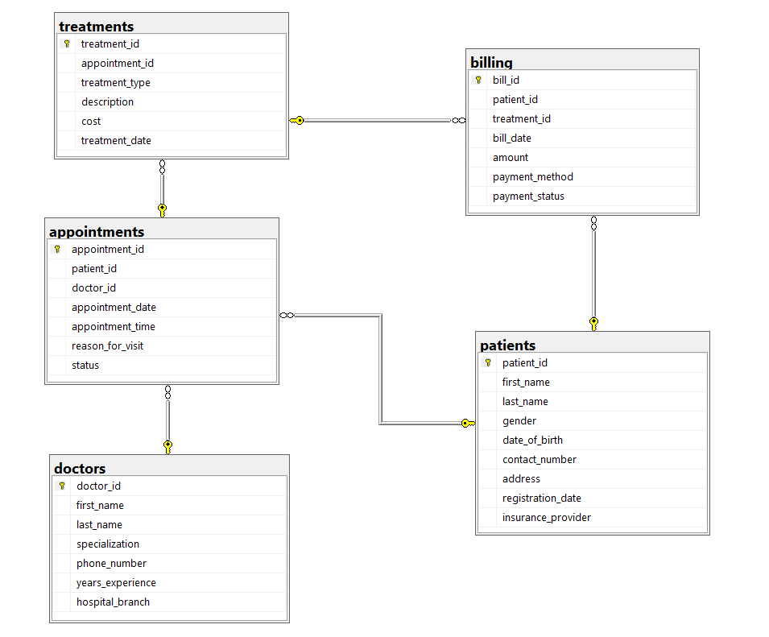

# 🏥 Hospital Management System – SQL Data Analysis Project

---

# 📌 Project Overview

This project designs and analyzes a **Hospital Management System database** using **SQL Server**. The database stores information about **patients, doctors, appointments, treatments, and billing**, allowing analysis of hospital operations and financial performance.

The goal of this project is to demonstrate **SQL skills including database design, joins, aggregations, and advanced analytical queries.**

---

# 🎯 Project Objectives

- Design a **relational hospital database**
- Establish **Primary Key and Foreign Key relationships**
- Perform **SQL analysis on healthcare data**
- Extract **insights about appointments, treatments, and revenue**

---

# 🛠 Tools Used

- **SQL Server Management Studio (SSMS)**
- **MySQL**

---

# 🗄 Database Tables

| Table | Description |
|------|-------------|
| Patients | Stores patient demographic details |
| Doctors | Contains doctor specialization and experience |
| Appointments | Records appointments between patients and doctors |
| Treatments | Stores treatment procedures and costs |
| Billing | Maintains billing and payment details |

---

# 🧩 Database Relationships

- **Patients → Appointments** (One-to-Many)  
- **Doctors → Appointments** (One-to-Many)  
- **Appointments → Treatments** (One-to-Many)  
- **Patients → Billing** (One-to-Many)  
- **Treatments → Billing** (One-to-Many)

---

# 🗄 Database Diagram

---

# 💻 SQL Queries Implemented

The project includes **15 SQL queries** categorized into three levels.

### Basic Queries
- Total hospital revenue
- Average treatment cost
- Patient distribution by gender
- Doctors by specialization
- Appointment distribution by status

### Intermediate Queries
- Patient appointments with doctor details
- Top doctors by number of appointments
- Treatments received by patients
- Patient billing information
- Treatments performed by specialization

### Advanced Queries
- Doctor ranking using **Window Functions**
- Top spending patients using **Subqueries**
- Running hospital revenue
- Appointment status categorization using **CASE**
- Treatments with cost above average

---

# 📊 Key Insights

- Total hospital revenue generated: **₹551,249.85**
- Average treatment cost: **₹2,756.25**
- **Male patients (31)** are higher than **female patients (19)**
- **Pediatrics department has the highest number of doctors**
- **No-show appointments are the most frequent appointment status**
- High-cost treatments significantly contribute to hospital revenue

---

# 📈 Conclusion

This project demonstrates how **SQL can be used to design relational databases and analyze healthcare data**.  
The analysis helps identify **patient trends, treatment costs, doctor workloads, and hospital revenue patterns**, enabling better decision-making in healthcare management.

---

⭐ If you found this project useful, consider giving it a **star**!
